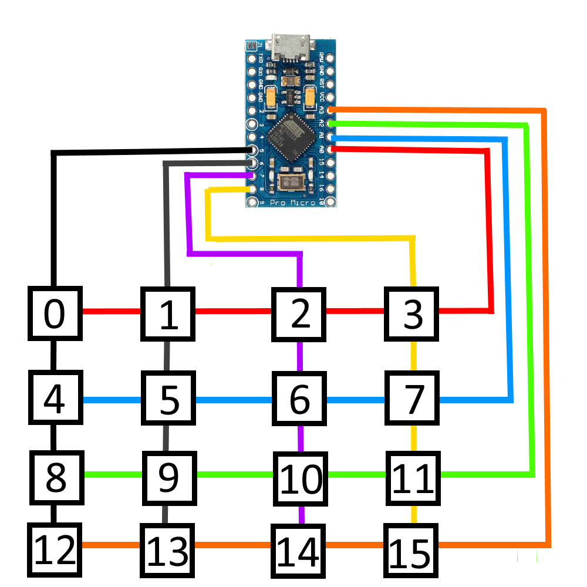

# 4x4 Macropad

3D Printed Macropad coded with arduino.
It can be used as a joytick or integrated with a python script that open softwares and make shortcut via serial comunication modules.
## Wire Diagram

